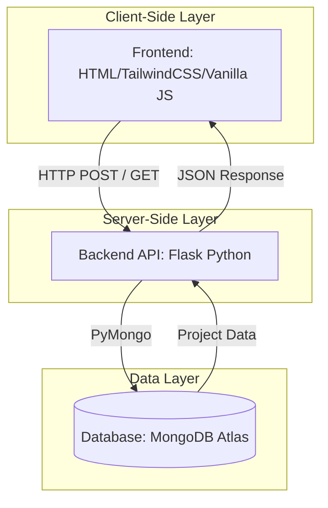

# IOTech - Industrial IoT Project Generator

Welcome to **IOTech**, an advanced, AI-powered platform designed to help makers, engineers, and industrial IoT experts instantly generate comprehensive IoT blueprints. Move from concept to deployment with full schematics, bill of materials (BOM), step-by-step assembly instructions, and ready-to-flash firmware.

 

---

## 🌟 Features

* **Multi-Page Industrial Dashboard**: A robust, multi-page frontend (Home, Generator, Ideas, Library) designed with a professional Industrial IoT aesthetic.
* **Light / Dark Mode**: Fluidly toggle between high-contrast light and dark themes optimized for long working sessions and readability.
* **AI-Powered Blueprints**: Describe any concept, and our AI pipeline synthesizes a complete, deployable project architecture.
* **Inspiration Database**: Browse a library of pre-generated, industry-standard ideas tailored to 10+ domains (Smart Agriculture, Asset Tracking, Smart Cities, etc.).
* **Personal Library**: Save and manage generated blueprints locally via your dashboard for quick reference.
* **Real-time Backend Data**: Utilizes MongoDB to reliably fetch, aggregate, and store highly accurate project details.

---

## 🏗️ Architectural Model

The platform operates on a robust, three-tier architecture:



### 1. Presentation Layer (Frontend)
- Built with modular **HTML5**, **Tailwind CSS** (via CDN for rapid prototyping), and **Vanilla JS**.
- Features an industrial-grade interface with dynamic DOM rendering for projecting JSON data into beautiful interactive components (Tabs, Code Blocks, BOM tables).

### 2. Logic Layer (Backend API)
- Driven by **Python Flask**.
- Handles API routing (`/api/generate`, `/api/quick-ideas`, `/api/save`), static page serving, and Cross-Origin Resource Sharing (CORS).
- Contains logic for querying the database securely and managing fallback JSON datasets.

### 3. Data Layer (Database)
- Powered by **MongoDB Atlas** for high availability.
- Aggregation pipelines efficiently query complex document structures representing complete IoT projects (including nested schemas for architecture layers, components, and code).

---

## 🚀 Getting Started

Follow these step-by-step instructions to run **IOTech** on your local machine.

### Prerequisites
- Python 3.8+
- Node.js (Optional, only if using external JS tools, but this project runs perfectly on Vanilla web stack)
- A MongoDB URI (Optional but recommended for full capability)

### Step 1: Clone the Repository
```bash
git clone https://github.com/Deep455-16/IOT-Generator.git
cd IOT-Generator-master
```

### Step 2: Set Up the Virtual Environment
It is recommended to run the Flask backend in an isolated Python environment.
```bash
# Windows
python -m venv venv
venv\Scripts\activate

# macOS/Linux
python3 -m venv venv
source venv/bin/activate
```

### Step 3: Install Dependencies
Install all required Python packages via pip:
```bash
pip install -r requirements.txt
```

### Step 4: Configure Environment Variables
Create a `.env` file in the root directory and add your MongoDB connection string:
```env
MONGO_URI=mongodb+srv://<username>:<password>@cluster.mongodb.net/?retryWrites=true&w=majority
PORT=5000
```
*Note: If no database is provided, the system falls back seamlessly to `projects.json`.*

### Step 5: Start the Backend Server
Launch the Flask application:
```bash
python app.py
```
*The server will start at `http://localhost:5000` or `http://127.0.0.1:5000`.*

### Step 6: Access the Dashboard
Open your preferred web browser and navigate to `http://localhost:5000`. You can freely navigate through:
- **/** : Home Page
- **/generator** : AI Project Generator
- **/ideas** : Inspiration Library
- **/saved** : Your local saved blueprints

---

## 🛠️ Contribution
We welcome contributions to IOTech! Whether it's enhancing the GUI, optimizing the backend pipeline, or expanding the MongoDB knowledge base.
1. Fork the repository.
2. Create your feature branch (`git checkout -b feature/AmazingFeature`).
3. Commit your changes (`git commit -m 'Add some AmazingFeature'`).
4. Push to the branch (`git push origin feature/AmazingFeature`).
5. Open a Pull Request.

## 📄 License
This project is licensed under the MIT License.
